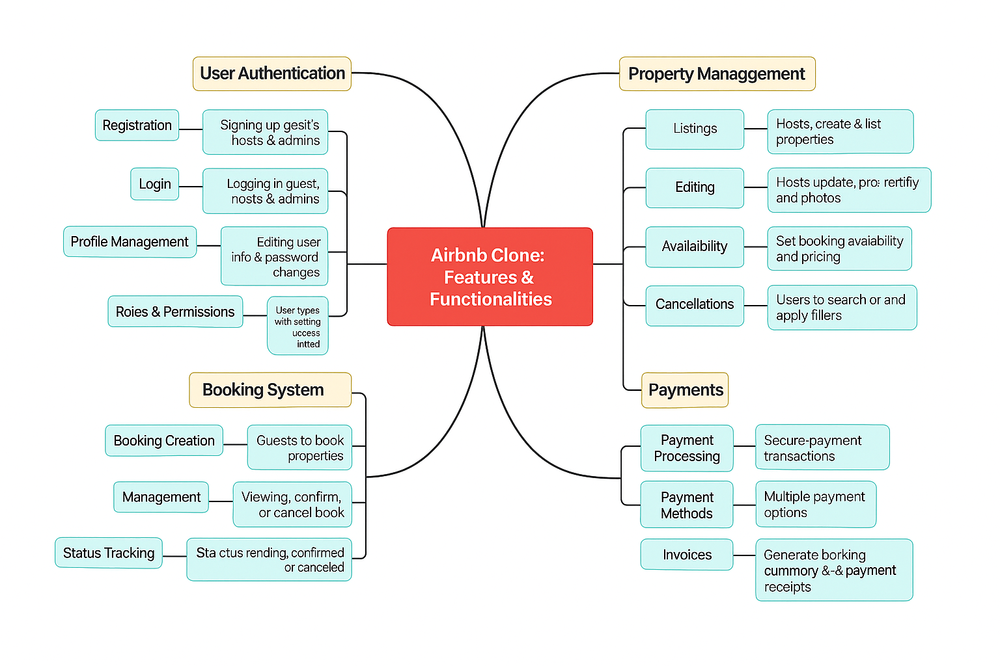

# Airbnb Clone Backend Features

This diagram outlines the key backend features and modules of the Airbnb Clone project, including:

- **User Authentication**: Registration, login, profile management, roles
- **Property Management**: Listings, editing, availability, search
- **Booking System**: Booking creation, status tracking, cancellations, notifications
- **Payments**: Payment processing, methods, invoices
- **Messaging**: Host-guest communication

