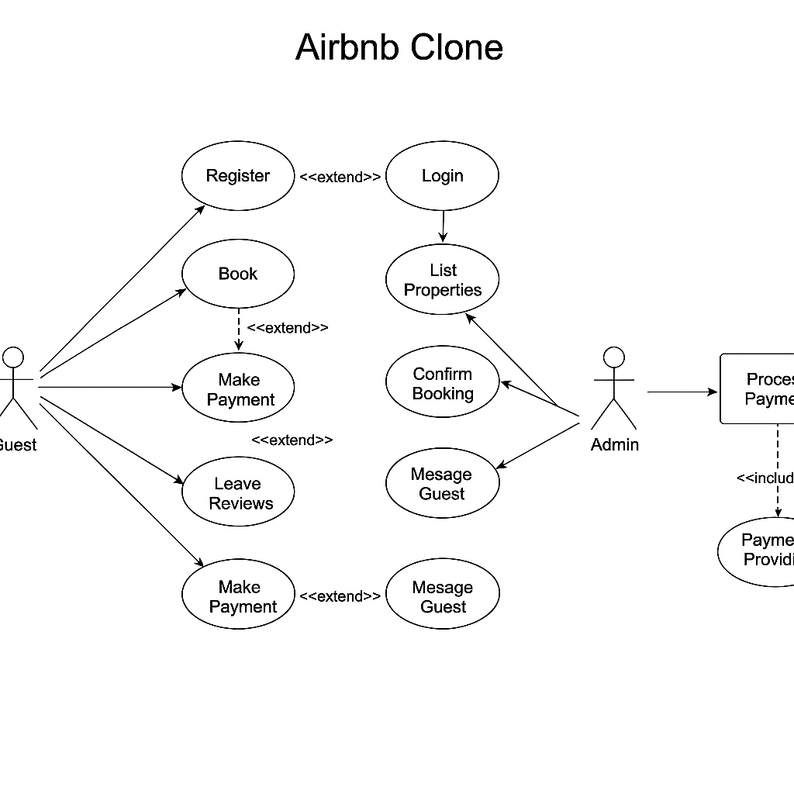

# Airbnb Clone Use Case Diagram

This diagram visualizes the key interactions between system actors and backend functionalities for the Airbnb Clone project.

**Actors:**
- Guest
- Host
- Admin
- Payment Provider

**Use Cases:**
- Register and Login
- Book Property and Cancel Booking
- Make Payment and Process Payment
- List and Manage Properties
- Send and Receive Messages
- Leave Reviews
- Manage Users and Listings (Admin)

